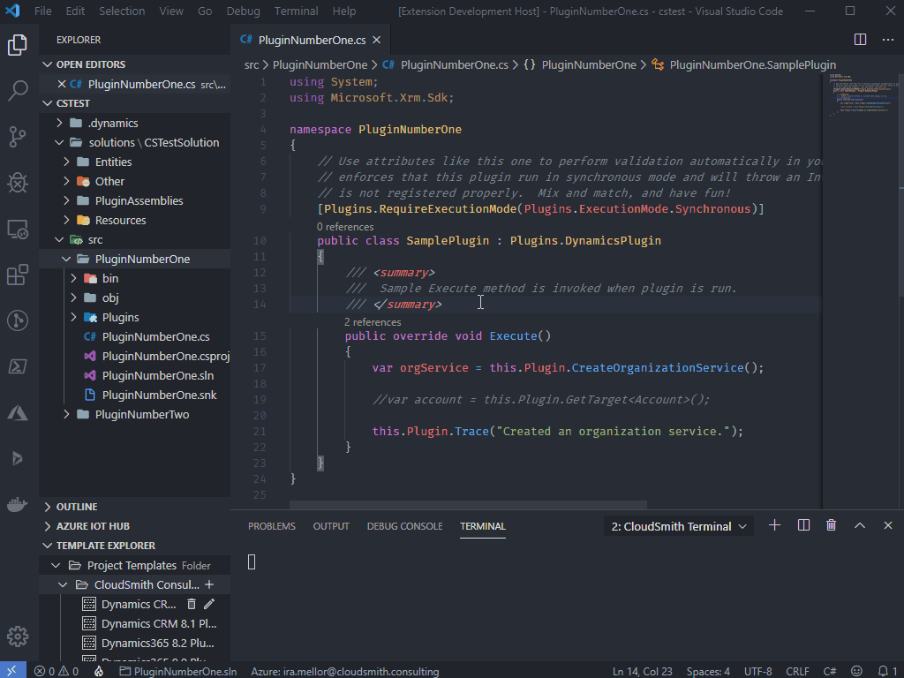

# How to: Use CrmSvcUtil to generate entities using CDS for Code

## Table of Contents

- [How to: Use CrmSvcUtil to generate entities using CDS for Code](#how-to-use-crmsvcutil-to-generate-entities-using-cds-for-code)
  - [Table of Contents](#table-of-contents)
  - [Overview](#overview)
  - [From the Command Palette](#from-the-command-palette)
  - [From File Explorer](#from-file-explorer)
  - [From CDS Explorer](#from-cds-explorer)

## Overview

The CDS for Code extension will call out to the SvcUtil.exe application to generate strongly typed code for your project to use when communicating with CDS. You can read more about [creating early bound entity classes here](https://docs.microsoft.com/en-us/dynamics365/customerengagement/on-premises/developer/org-service/create-early-bound-entity-classes-code-generation-tool).

## From the Command Palette

To generate entities using the command palette:

1. Open the VSCode command palette (Ctrl + Shift + P)
2. Search for and select Generate entity code from metadata on a registered CDS environment
3. Select the target organization
4. Select the target folder
5. Type in the desired file name and press enter
6. Type in the desired Namespace and press enter

When put into action it will look similar to this:

## From File Explorer

To generate entites from VSCode File Explorer:

1. Right-click on the folder or exact file you want the entites to be generated to
2. Select your target organization
3. If you selected a folder it will prompt you for a file name
4. Type in the desired namespace and press enter

Generating code from File Explorer will look similar to this:

## From CDS Explorer

Coming soon!
